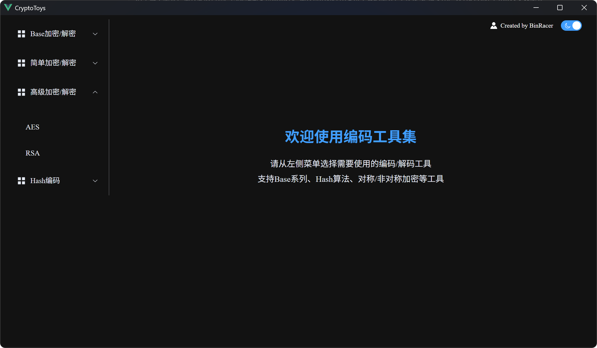
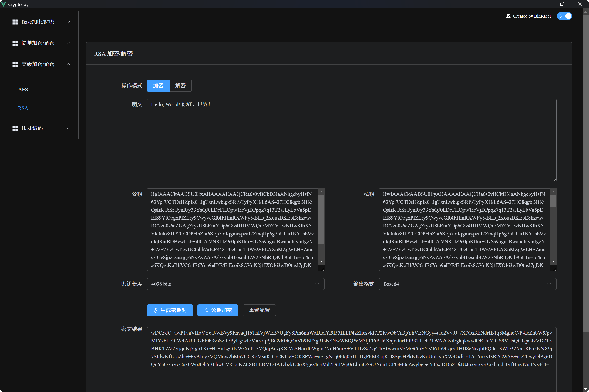
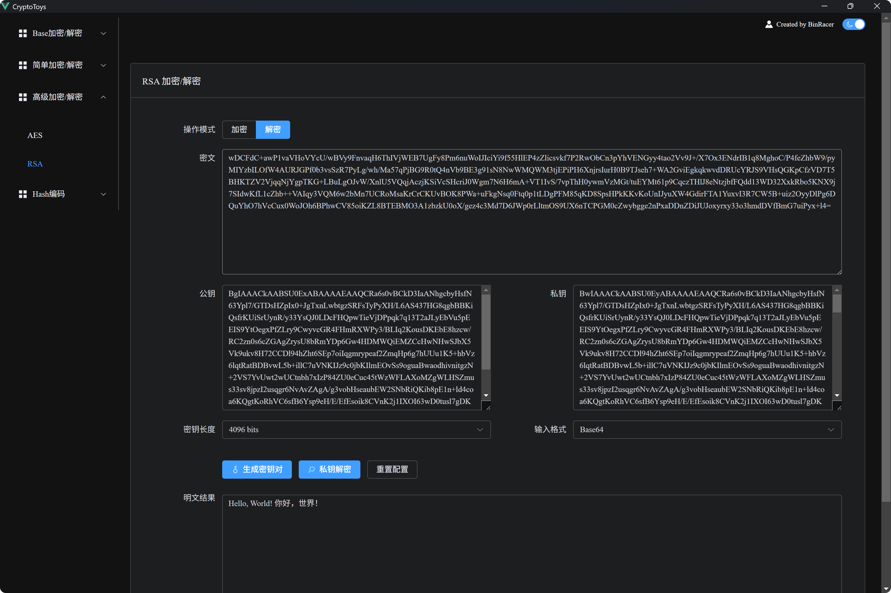

```text                                                                                                                                                                                                          
        CCCCCCCCCCCCC                                                                       tttt                        TTTTTTTTTTTTTTTTTTTTTTT                                                    
     CCC::::::::::::C                                                                    ttt:::t                        T:::::::::::::::::::::T                                                    
   CC:::::::::::::::C                                                                    t:::::t                        T:::::::::::::::::::::T                                                    
  C:::::CCCCCCCC::::C                                                                    t:::::t                        T:::::TT:::::::TT:::::T                                                    
 C:::::C       CCCCCCrrrrr   rrrrrrrrryyyyyyy           yyyyyyyppppp   ppppppppp   ttttttt:::::ttttttt       oooooooooooTTTTTT  T:::::T  TTTTTTooooooooooo yyyyyyy           yyyyyyy  ssssssssss   
C:::::C              r::::rrr:::::::::ry:::::y         y:::::y p::::ppp:::::::::p  t:::::::::::::::::t     oo:::::::::::oo      T:::::T      oo:::::::::::ooy:::::y         y:::::y ss::::::::::s  
C:::::C              r:::::::::::::::::ry:::::y       y:::::y  p:::::::::::::::::p t:::::::::::::::::t    o:::::::::::::::o     T:::::T     o:::::::::::::::oy:::::y       y:::::yss:::::::::::::s 
C:::::C              rr::::::rrrrr::::::ry:::::y     y:::::y   pp::::::ppppp::::::ptttttt:::::::tttttt    o:::::ooooo:::::o     T:::::T     o:::::ooooo:::::o y:::::y     y:::::y s::::::ssss:::::s
C:::::C               r:::::r     r:::::r y:::::y   y:::::y     p:::::p     p:::::p      t:::::t          o::::o     o::::o     T:::::T     o::::o     o::::o  y:::::y   y:::::y   s:::::s  ssssss 
C:::::C               r:::::r     rrrrrrr  y:::::y y:::::y      p:::::p     p:::::p      t:::::t          o::::o     o::::o     T:::::T     o::::o     o::::o   y:::::y y:::::y      s::::::s      
C:::::C               r:::::r               y:::::y:::::y       p:::::p     p:::::p      t:::::t          o::::o     o::::o     T:::::T     o::::o     o::::o    y:::::y:::::y          s::::::s   
 C:::::C       CCCCCC r:::::r                y:::::::::y        p:::::p    p::::::p      t:::::t    tttttto::::o     o::::o     T:::::T     o::::o     o::::o     y:::::::::y     ssssss   s:::::s 
  C:::::CCCCCCCC::::C r:::::r                 y:::::::y         p:::::ppppp:::::::p      t::::::tttt:::::to:::::ooooo:::::o   TT:::::::TT   o:::::ooooo:::::o      y:::::::y      s:::::ssss::::::s
   CC:::::::::::::::C r:::::r                  y:::::y          p::::::::::::::::p       tt::::::::::::::to:::::::::::::::o   T:::::::::T   o:::::::::::::::o       y:::::y       s::::::::::::::s 
     CCC::::::::::::C r:::::r                 y:::::y           p::::::::::::::pp          tt:::::::::::tt oo:::::::::::oo    T:::::::::T    oo:::::::::::oo       y:::::y         s:::::::::::ss  
        CCCCCCCCCCCCC rrrrrrr                y:::::y            p::::::pppppppp              ttttttttttt     ooooooooooo      TTTTTTTTTTT      ooooooooooo        y:::::y           sssssssssss    
                                            y:::::y             p:::::p                                                                                          y:::::y                           
                                           y:::::y              p:::::p                                                                                         y:::::y                            
                                          y:::::y              p:::::::p                                                                                       y:::::y                             
                                         y:::::y               p:::::::p                                                                                      y:::::y                              
                                        yyyyyyy                p:::::::p                                                                                     yyyyyyy                               
                                                               ppppppppp                                                                                                                                                                                                        
```

[](https://img.shields.io/badge/license-MIT-blue)
[](https://img.shields.io/badge/C++-17-blue)
[](https://github.com/BinRacer/YanLib)
[](https://cmake.org/cmake/help/v3.16/)
[](https://doc.qt.io/qt-6/zh/index.html)
[](https://img.shields.io/badge/Platform-Windows-blue)

**CryptoToys** 是一款基于 **YanLib** 的在线加密解密工具集。

主要包含 **Base加密/解密**、 **简单加密/解密**、**高级加密/解密**、**Hash编码** 四大模块。

## 🤔为什么开发？

首先，**YanLib** 是一款基于 **C++** 的 **RAII** 的思想，实现完全的资源自动管理，而且运行保持高效而且安全的 Windows 运行库。

为了体现**YanLib**的优点，我使用其crypto和hash模块，构建了本项目**CryptoToys**。

为了界面友好地展示，我使用Qt开源版本添加了图形化界面。

## 💼功能菜单

+ 🏷️base加密/解密
    - base16
    - base32
    - base58
    - base62
    - base64
    - base85
    - base91
    - base92
    - base100
+ 🏷️简单加密/解密
    - uuencode
    - xxencode
    - vigenere
+ 🏷️高级加密/解密
    - AES
    - RSA
+ 🏷️hash编码
    - md5
    - sha1
    - sha256
    - sha384
    - sha512

## 程序运行主界面



## **RSA** 加密样例



## **RSA** 解密样例



## 注意

由于YanLib.lib依赖库比较大，请去YanLib项目release下载。本项目不包含完整的库文件，只包含头文件。

## 声明

本产品包含Qt库，Copyright © The Qt Company Ltd.，遵循LGPLv3协议。Qt是The Qt Company Ltd的注册商标。

本程序动态链接Qt库，未修改其源代码。
